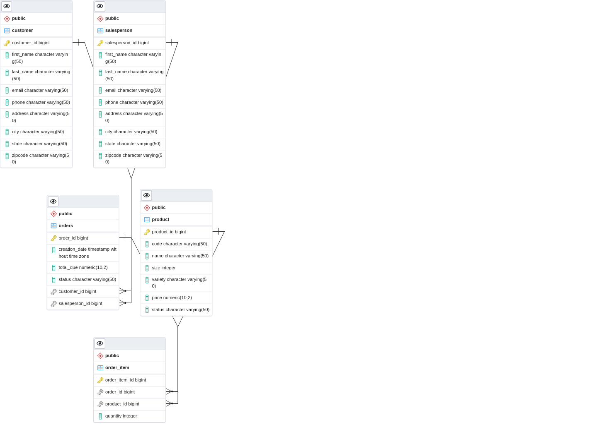

# Introduction

The goal of this application is to show how to use the JDBC (Java Database Connectivity) API to perform common database CRUD (Create, Read, Update, Delete) actions. The CRUD operations were also carried out using the DAO and DTO patterns. The sample application was ran using the Postgres JDBC driver and a Postgres database running in a Docker container. 

# Implementation
The ER diagram and associated design patterns for performing CRUD tasks are explained in this section.
## ER Diagram



## Design Patterns

The Data Access Object (DAO) is a design paradigm that separates the application/business layer from the persistence layer. The API hides all of the complexities of executing CRUD activities in the underlying storage system from the application.

Between the rest of the application and the data access logic, the Repository design works as an intermediate layer. The design separates the application's data access code from the rest of the code.
It's a collection of objects that's been abstracted. When SQL JOINS aren't necessary, it's more commonly employed.

# Test

The application was tested using a Docker container that ran the Postgres database. For each step of the creating, inserting and updating, and deleting actions, JDBCExecutor has been adjusted. Additionally, the main method was used to test procedure and limits.

The database was established and the test data was loaded using SQL scripts (shown below). This information was then used to compare and contrast the outcome.

```bash
#Data Setup
#Create database:
SQL -h localhost -U Postgres -f database.sql

#Insert test customer data into the customer table
SQL -h localhost -U Postgres -d passport -f customer.sql

#Insert test product data into product table
psql -h localhost -U Postgres -d hplussport -f product.sql

#Insert test salesperson data into salesperson table
psql -h localhost -U Postgres -d hplussport -f salesperson.sql

#Insert test orders data into orders table
psql -h localhost -U Postgres -d hplussport -f orders.sql
```
