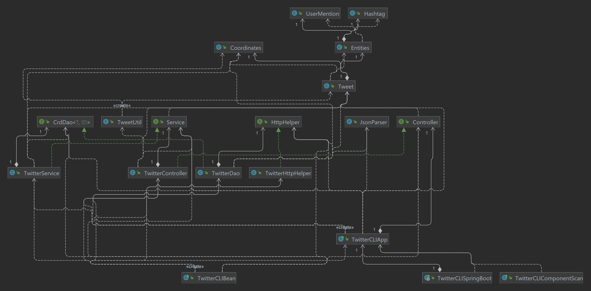

# Introduction
Using the Twitter REST API, this app allows you to create, read, and remove existing Tweets. Maven, HTTP client, Docker, Twitter REST API, and Java libraries are among the technologies used in the project. Users can make new tweets by specifying the status and coordinates (latitude:longitude), search for existing tweets by ID, or delete numerous tweets by specifying an array of IDs in this application. The retrieved tweets are then shown to the terminal in JSON format. OAuth 1 credentials are used to post the tweet to the Twitter account.
# Quick Start
The project was able to produce JAR files, clean the project, and copy related dependencies from the remote Maven repo to the local Maven repo using the mvn command. The following command was used to clean and package the app using Maven:\
 ```mvn clean package```

The application may be run with Docker by downloading the image from DockerHub and using the -e flag to 
specify all of the relevant OAuth tokens acquired from the Twitter account.\
```docker pull kdabhi /twitter```

The -e flags, as indicated previously, are an example of the app's use with Docker. All the tokens generated by a Twitter developer account OAuth v1 are consumerKey, consumerSecret, accessToken, and tokenSecret. The following is an example Docker run statement:
An example of the app usage with Docker has the -e flags as mentioned previously. The **consumerKey**, **consumerSecret**,
**accessToken**, and **tokenSecret** are all tokens generated through a Twitter developer account OAuth v1. A sample Docker run statement would be as follows:
```
docker run --rm \
-e consumerKey=YOUR_VALUE \
-e consumerSecret=YOUR_VALUE \
-e accessToken=YOUR_VALUE \
-e tokenSecret=YOUR_VALUE \
kdabhi/twitter post "post description" "latitude:longitude"
```

# Design
## UML diagram

## Components
**- Main/twitterCLI:** This component is used to call all the application's appropriate components by establishing new instances of each Twitter class as dependencies, then calling the run function to call the corresponding parts.
The controller's technique is based on the first command line argument.

**- Controller:** This component consumes the user's input via command line arguments before passing it on to the relevant service method
to take care of the business logic.\
**- Service:** This component is in charge of the input handling and validation logic. It verifies that tweets are 140 characters or less in length and that the provided longitude and latitude are within range by validating the format of tweet IDs. \
**- DAO:** This component manages the HTTP Client and Twitter REST API, as well as data stored in external storage. The DAO component is responsible for interpreting HTTP responses and constructing the API URI.
## Models
The Tweet model is used to store a reduced version of the Tweet object that is constructed using JSON data from the Twitter API. The Tweet model's parameters are as follows:
- **createdAt**: Represents the creation date of the tweet. Within the JSON, this field is used to store the created at value.

- **tweetId**: A numeric datatype that represents the id of a tweet. Within the JSON, this field is called id.

- **idStr**: A string representation of the tweet's id. Within the JSON, this variable holds the value of id str.

- **text**: This represents the tweet's text. Within the JSON, this variable stores the value of text.
- **source**: Represents the location of the tweet's origin. Within the JSON, this variable holds the value of source.
- **coordinates**: Represents the coordinates of where the tweet was sent from; it is stored in the Tweet model using the Coordinates model.
- **entities**: Represents the tweet's entities, and stores data in the Tweet model using the Entities model.
- **retweetCount**: The number of times a tweet has been retweeted.
- **favoriteCount**: Indicates how many favourites there are.
- **favourite**: A boolean value that indicates whether the user favorite the tweet.
- **retweeted**: A boolean value that indicates if the tweet was retweeted by the user.

## Spring
The Spring Framework was utilised to assist in the problem of dependency management. It uses the Inversion of Control or dependency injection approach to replace the TwitterCLIApp with a Spring framework. They are marked as Beans in the ```TwitterCLISpringBoot``` using `@Component`, `@Controller`, `@Service`, and` @Repository` in the layers to replace the old main approach.

# Test
JUnit4 was used to test the classes' workflow. It lets you to compare the predicted and actual results using assertEquals and assertNotNull statements. The TwitterService was JUnit tested to confirm that the respective methods returned a Tweet object. 

Mockito was used to test the implementation of classes using a mock of the dependency - this was done to test classes without evaluating the implementation of the dependencies so that it could yield a controlled object using a fake object.

## Deployment
This application was dockerized by writing a Dockerfile that copied all of the JAR files from the classes in the target/twitter directory to a local directory, allowing the Docker image to be created locally. It is then pushed to DockerHub when it has been constructed locally. The Dockerfile's contents are as follows:
```
FROM openjdk:8-alpine
COPY target/twitter*.jar /usr/local/app/twitter/lib/twitter.jar
ENTRYPOINT ["java","-jar","/usr/local/app/twitter/lib/twitter.jar"]
```

# Improvements
In this project, there are three things we can enhance.
- Instead, use the Twitter V2 API, which is the most recent.
- To handle failing HTTP status and end any open connections, use a try-catch with finally clause.
- Instead, use the Twitter4J Java library (https://twitter4j.org/en/index.html). This will make the software easier to use.