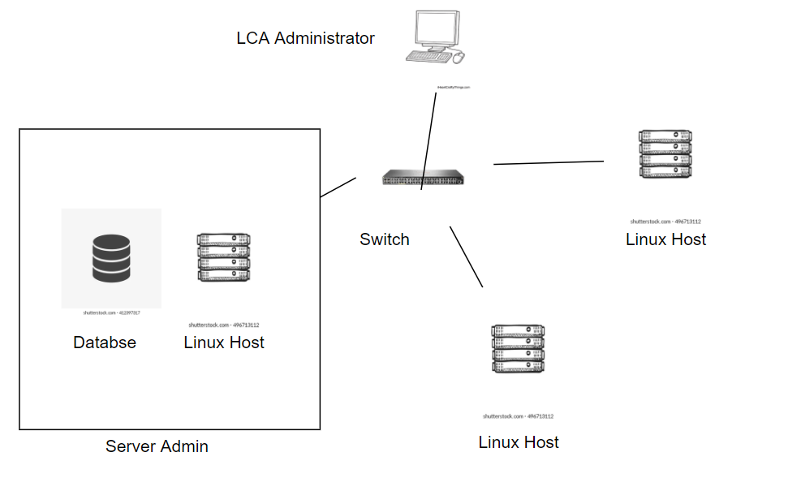

# Introduction
The main goal of this project is to make  Minimum Viable Product (MVP) of a Linux Cluster Monitoring system(LCM). The LCM made in this project can be used to record hardware specifications of several nodes/servers which are connnected with each other internally  through a switch and communicate with IPv4. LCM is mainly used by Cluster Administration Team which manages and plans the resources for servers in a company. The data is then stored into a RDBMS server which can be used by the team to generate more information. This can help the administration team monitor and support the cluster in a better way.

The technologies used for this project are Bash scripts, Postgres v9.6 database, psql v9.2, git v2.30.1, Docker v20.10.11, IntelliJ IDEA v2021.2.3, Jarvis Remote Desktop (JRD) - Remote development and testing environment running CentOS 7, Google Cloud Platform (GCP) provided the instance to run the JRD


# Quick Start

- Start a psql instance using psql_docker.sh
```bash
psql_docker.sh start
```
- Create tables using ddl.sql
```bash
psql -h localhost -U postgres -d host_agent -f sql/ddl.sql
```
- Insert hardware specs data into the DB using host_info.sh
```bash
bash host_info.sh psql_host psql_port db_name psql_user psql_password
```

- Insert hardware usage data into the DB using host_usage.sh
```bash
bash host_usage.sh psql_host psql_port db_name psql_user psql_password
```
- Crontab setup
```bash
* * * * * bash <your path>/linux_sql/scripts/host_usage.sh localhost 5432 host_agent postgres password > /tmp/host_usage.log
```

# Implemenation
The following shows how the project was implemented which describes Architecture, Scripts and Database Modeling
## Architecture
The diagram below shows the overall architecture of the project

## Scripts
The following are a description of all the scripts used in the project.
## psql_docker.sh
### Description
This script was used to Create, Start/ Stop the docker container which runs the Postgres database if it already doesn't exist.
### Usage
The following command will start the Postgres container. Here psql_username is the Postgres username and psql_password is the Postgres password.```
psql_docker.sh create psql_username psql_password
```

The following command will start the Postgres container.
```bash
psql_docker.sh start
```

The following command will stop the Postgres container.
```bash
psql_docker.sh stop
```

## host_info.sh
###Description
This script will collect all the host hardware information on the node/server and send them to Postgres database. This script collects data such as hostname,CPU information, and  memory information.
###Usage
The command below will insert the hardware specifications data into the Postgres database. Here psql_host is the hostname running the database, psql_port is the port number,
db_name is the database name we want to add specs. into, psql_user is the Postgres username, and psql_password is the Postgres password used when creating the database.
```bash
host_info.sh psql_host psql_port db_name psql_user psql_password
```
##host_usage.sh

###Description
This script will be running every minute by using crontab. It will collect all the host usage such as CPU-Information, and Disk Usage Information.
###Usage
The command below will insert the usage data into the database. Here psql_host is the hostname running the database, psql_port is the port number, db_name is the database name we want to add specs. into, psql_user is the Postgres username, and psql_password is the Postgres password used when creating the database.
```bash
host_info.sh psql_host psql_port psql_name psql_user psql_password
```
##crontab
###Description
The cron process from Linux is used to run the host_usage.sh script every one minute after configuring the crontab file. This can be double-checked by looking at the tables in the postgres database if they are being populated every minute then the scripts are working properly.
###Uage
We can edit the crontab file with the following command
```
crontab -e
```
Add following line to the file to make it run every minute
```
* * * * * bash <your path>/host_usage.sh psql_host psql_port db_name psql_user psql_password > /tmp/host_usage.log
```
##queries.sql
This SQL script contains sample SQL queries for use with the monitoring data.
The first query displays all of the servers, along with their total memory and number of CPUs. This is a simple way to look at the server inventory. The second query displays the average amount of RAM consumed during a 5-minute period. This is quite useful for determining whether or not the servers contain the required information.
Whether the necessary amount of memory is required, or if more memory is required The final query can be used to determine if a server is still operational indata transmission to the monitoring server.
````
psql -h localhost -U postgres -d host_agent -f queries.sql    
````
## Database Modeling
The host_agent postgres database contains two tables that are storing the data:

##host_info

This table keeps track of each Linux server's host hardware. When the data is loaded, a unique serial number is generated, which is then utilised to add the Linux server consumption data to the database. The number, architecture, model, speed, and cache of the CPU, as well as the total amount of RAM in the system, are all listed in this table.

Column | Type | Description
--------------|------|--------------
id | `SERIAL` | When you insert data into the database, it generates a unique identity for you. The primary key is this column.
hostname | `VARCHAR` | The hostname of the Linux server is stored here.r
cpu_number | `INTEGER` | The number of CPUs in the server is listed here.
cpu_architecture | `VARCHAR` | The architecture of the server's CPU is stored here.
cpu_model | `VARCHAR` | The model of the server's CPU is stored here.
cpu_mhz | `FLOAT` | The clock speed of the server's CPU is stored here.
L2_cache | `INTEGER` | The size of the L2 cache of the server's CPU is stored here..
total_mem | `INTEGER` | This value represents the total amount of memory space installed on the server.
timestamp | `TIMESTAMP` | When data is added to the database, this is the timestamp. The server's current timestamp is used by default.

##host_usage

The information as to how the host is used is stored in this table. The host id is used to identify which server the request originated from. The table shows how much memory is free in the system, how much CPU is used, how much disc IO is used, and how much disc is accessible.

Column | Type | Description
--------------|------|--------------
timestamp | `TIMESTAMP` | When data is added to the database, this is the timestamp. The server's current timestamp is used by default.
host_id | `SERIAL` | The id of the host from which the use data was gathered. This is the id from the host info table's foreign key.
memory_free | `INTEGER` | The amount of free memory is stored here.
cpu_idle | `DECIMAL` | The percentage of the CPU that is idle is stored here (i.e. not being used).
cpu_kernel | ` DECIMAL` | The proportion of CPU use for the kernel currently in use is stored here.
disk_io | `INTEGER` | The current quantity of disc I/O is stored in this variable.
disk_available | `INTEGER` | The amount of storage space available in the server's root directory.


# Test
The bash scripts were created and tested on a Jarvis Remote Desktop instance running Centos 7 on a Google Cloud infrastructure. The complete solution may be developed and tested on this single server. It had a Postgres database operating in a Docker image. The programmes were able to submit their data toward this database, and SQL queries were able to be constructed using it. Test data was manually entered into the database when some data was missing (for more than one server).

# Deployment
GitHub is used to keep track of the source code for this project. Crontab is used to put records into the host usage table by calling the host usage.sh script every minute to retrieve host resource usage data.
The database container produced from the Postgres 9.6-Alpine image is held in Docker.

# Improvements
- The existing solution keeps the data indefinitely. A system for archiving and deleting older data from the database is required.
- If the data cannot be added to the database, the present scripts do not perform any error checks. This could happen if there's a problem with the database or if it's down for any reason. When the database is unable to receive the script information, a mechanism must be created to save the data locally and later transfer it to the database.
- This is a very light-weight aplication of a Cluster Monitoring Agent, so a GUI for it can be a good improvement to the project.
